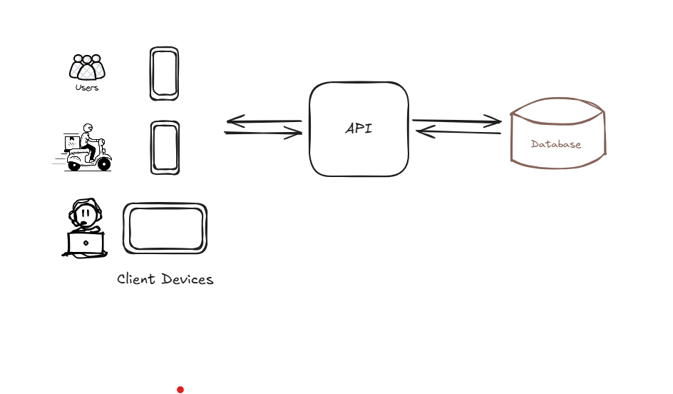

# Delivery App Challenge for Bain &amp; Company

## Questions

#### 1.  Tell us what pieces of software you think are necessary to develop for the working prototype and how they are related. We call each application (web, mobile or desktop),each API, each batch process that can be deployed independently a piece of software. Support yourself with a diagram if you think necessary.

For the prototype, focus on five core pieces of software:

- `Customer Mobile App`: A simple interface for ordering and tracking.

- `Restaurant Dashboard`: A web or desktop app for order management.

- `Rider Mobile App`: Basic mobile interface for accepting orders and updating status.

- `REST API`: Server that handles the both frontends requests and talks to the database.

- `MongoDB databse`: NoSQL database for storing every information: orders, user data, and restaurant menus.

This works well for a prototype because avoids unnecessary complexity (e.g., async processes or microservices), uses a single API + database to reduce development/deployment time and prioritizes core functionality: ordering and delivery, the value proposition. If the app succeeds, we can move to a more complex architecture. 

  

#### 2. Tell us about the type of architecture you chose for question (1). Monolithic? Micro-services? Any intermediate? Other? Comment on what you based to make this decision.

The decision prioritizes delivering a functional MVP quickly, so the monolithic architecture is ideal. The the simplicity of a monolithic architecture can provide a faster development/deployment, critical for validating the business thesis fast. The monolithic architecture is more cheaper too.

#### 3. Describe the work methodology you would use for development. It can be some known methodology (Scrum, XP, RUP), an adaptation, or a mixture between several methodologies. Whatever your experience has shown you works. Tell us why you think this form is appropriate for our problem.
The goal is to build a prototype that actually works for users, fast, while staying ready to pivot if needed. So i’d go with Scrum. We’d work in small sprints (1 or 2 weeks) to build core features step by step (like sending order first, then delivery tracking, then user notifications). Daily quick meetings to keep the small team aligned and unblocked. We’d team up with the Impact Lead to sort the to-do list, so we focus on what’s most important for the MVP. This keeps things flexible—if priorities change, we adapt fast. The scrum structure helps us move quick but organized.

#### 4. Describe the workflow you would use to collaborate using Git. As with (3), you can use something familiar or an adaptation.

We’d use a simplified Git workflow to move fast:

- `Main Branch`: Always stable and reflects the production code. Direct commits blocked—everything goes through pull requests (PRs).
- `Feature Branches`: Create branches for tasks (e.g., feature/order-change, fix/login-bug).
- `development branch`: Optional branch, so the code in there can be deloyed in a different environment and be tested before go to the main branch. It can increase the costs.

All the merges are created after PRs reviews: Teammates review code in PRs before merging.

#### 5. Do you think it is necessary to add any extra member to the team during the development of the prototype? What would your role be? Do you think it would be necessary to add new members after the prototype phase? When and why?

For the prototype phase, the current team is sufficient. Adding members in this phase could slow down decisions and the product delivery. 

My role as technology leader is to prioritize tasks considering their technical difficulties, unblock the team with their technical issues and ensure alignment.

After the prototype succeeds - validating the traction indicators like user growth, revenue signals - new roles can become important to scale the product to deal with the demand:

- `DevOps Engineers`: For some CI/CD and cloud infrastructure - moving to microservices can demand Cloud/Kubernetes experient people. Besides the ability create monitoring tools for the system demands, like processing and memory (Grafana and Logs can be very usefull here).
- `Backend Engineer`: To help the migration from monolith to microservices.
- `QA/Testing`: To ensure reliability as features grows.

#### 6. What other considerations would you have to make the development process robust and efficient?

To keep development process efficient, I’d focus on automation through CI/CD pipelines for quick deploys. For the making the process and the product robust, I'd use TDD (Test Driven Delopment), adding basic tests for every critical features like order placement; I'd also invest time in monitoring tools (Logs and Grafana), so we can track the bugs and bottlenecks efficientlly; And finally i'd enforce code quality: clean, modular code (readable names, single-purpose functions and classes), design patterns (e.g., AbstractFactory for payments) for flexibility and future maintainability, and clear comments for complex logics.